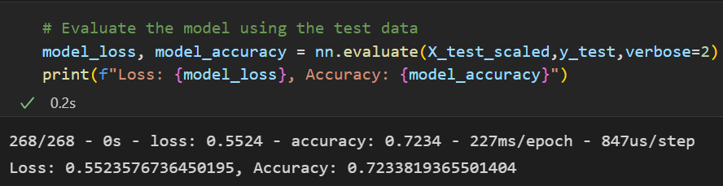
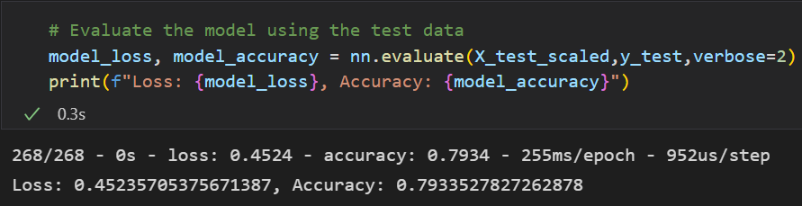

# Neural_Network_Charity_Analysis
Neural Networks, Deep Learning, sklearn, tensorflow, pandas

# Overview
The purpose of this analysis is to create a binary classifier that is capable of predicting whether applicants will be successful if funded by the Alphabet_Soup company. 

# Results
Before optimizing the model, our results did not meet the 75% target:

After optimizing the model, our results exceeded the 75% target:

## Data Preprocessing
> What variables are considered the targets for the model?
* The "Is-Successful" column is the target, because it tells us the outcome of the application.
> What variables are considered the features for the model?
* In the optimized version of the model, we re-added the "NAME" column as a feature along with "APPLICATION_TYPE", "AFFILIATION", "CLASSIFICATION", "USE_CASE", "ORGANIZATION", "STATUS", "INCOME_AMT", "SPECIAL_CONSIDERATIONS", and "ASK_AMT".
> What variables are neither targets nor features, and should be removed from the input data?
* The "EIN", or Employee Identification Number, must be removed for accurate results as it could confuse the model. 

## Compiling, Training, and Evaluating the Model

> How many neurons, layers, and activation functions did you select for your neural network model, and why?
* In the first layer, I used a Relu activation function with 100 neurons
* In the second layer, I used a Sigmoid activation function with half the amount of neurons, 50. 
* In the third hidden layer, I used a Sigmoid activation function with half the amount of neurons, 25.
* In the output layer, I used a Sigmoid activation function with the single neuron needed for the model. 
> Were you able to achieve the target model performance?
* Yes
> What steps did you take to try and increase model performance?
* While optimizing the model to reach the 75% goal, I tried countless combinations of neurons, layers, and functions with no success. It wasn't until I went back and considered the "NAME" column that we dropped in the initial model to add to the optimized model that I had success. I realized that the name was important because the same company is likely to be consistent on its success on multiple applications. I tried to run it, but the model became over-fit and useless, so I tried to "bin" the names with fewer applications together to increase the model's speed as well as avoid over-fitting. After binning, the model was immediately successful and it took only minor adjustments to get the accuracy to be ~80%. 

# Summary
The overall results of the model were successful after optimization due to the adding of the "NAME" feature, adding a third hidden layer, and using a combination of Relu and Sigmoid activation functions. Our accuracy score ended up being 79.3% which exceeds the 75% goal. 
If required to use a different model for this classification problem, I would recommend the Random Forest model because of its flexibility and use of decision trees. The "RF" model is often used in supervised machine learning to tackle classification problems like this with a high degree of success.